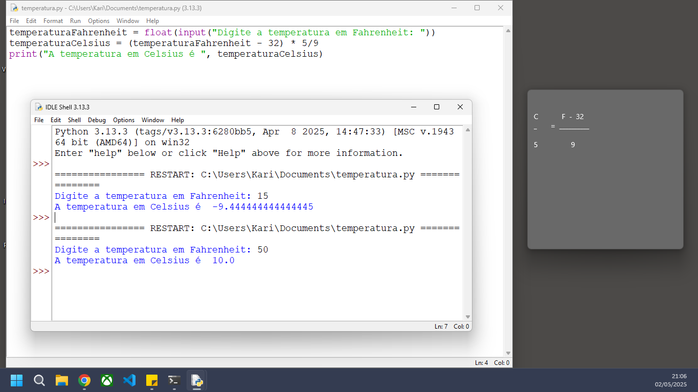

# Estudos em Python - Lógica 

Este repositório contém pequenos scripts e exercícios desenvolvidos durante meus estudos da linguagem Python no curso Introdução à Ciência da Computação com Python da USP. A ideia é praticar conceitos básicos e avançar gradualmente na linguagem.

## conversor de temperatura

Um dos primeiros desafios em scripts é um conversor simples de temperatura de Fahrenheit para Celsius.

  

