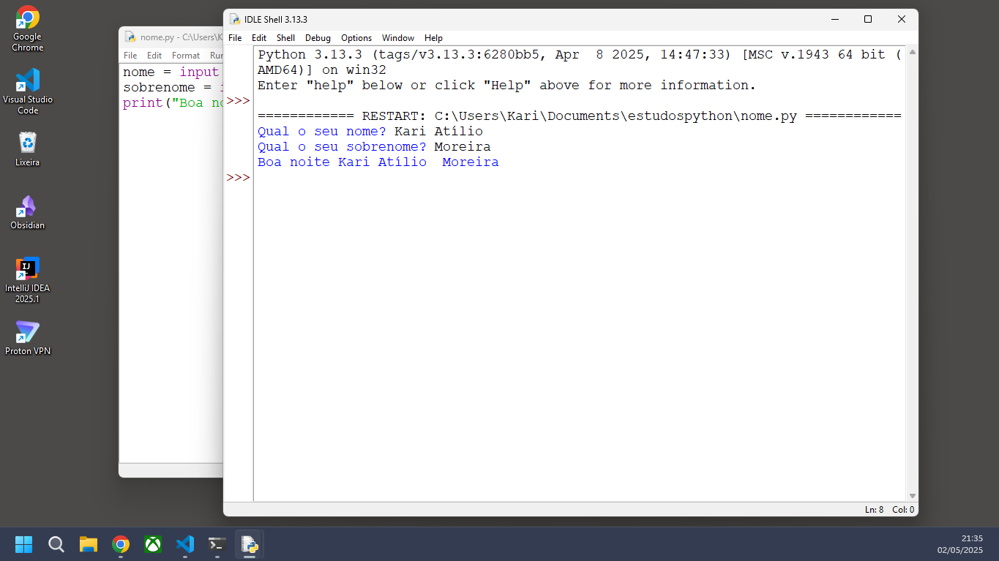
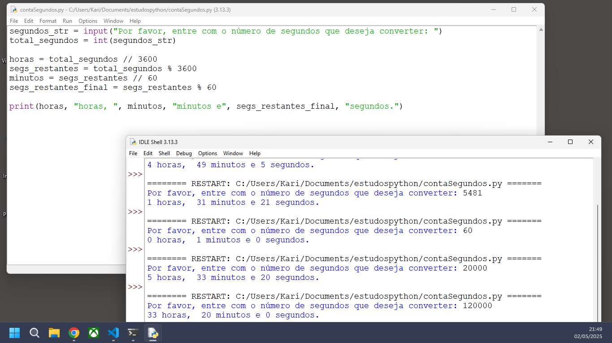

# Estudos em Python - Lógica 

Este repositório contém pequenos scripts e exercícios desenvolvidos durante meus estudos da linguagem Python no curso Introdução à Ciência da Computação com Python da USP. A ideia é praticar conceitos básicos e avançar gradualmente na linguagem.

## conversor de temperatura

Um dos primeiros desafios em scripts é um conversor simples de temperatura de Fahrenheit para Celsius.

  

## Nome

Neste desafio entendemos o conceito de entrada e saída no python.

  

## Conta segundos

Já neste desafio o objetivo foi criar um script que recebe um valor inteiro representando uma quantidade de segundos e converte esse valor para o formato de horas, minutos e segundos.

  

